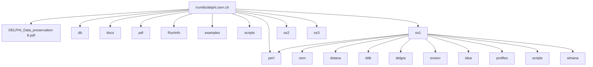

[[_TOC_]]

# Introduction
This quick start guide is meant as a guide for the very first steps to get going with DELPHI software and data access.

## Overview

The /cvmfs/delphi.cern.ch repository contains the software binaries and sources for running:

* DELPHI analysis framework (dstana)
* MonteCarlo production (delsim/delana/shortdst production)
* Event reconstruction (the DELPHI event server)
* Event viewing with delgra

## Before you start ...

Please read and accept the data access rules.

DELPHI data access rules are available at
```
https://delphi-www.web.cern.ch/delphi-www/delsec/finalrules/DELPHI_Data_preservation-8.pdf
```
Please read these before accessing the DELPHI software and data.

Note that this software is provided "as is" within the DPHEP activity. Doing any analysis based on it requires careful cross checks with
original data samples as well as blessing from the collaboration.

## Requirements
Binaries are provided for Linux only. There are no native Windows or Apple ports available, however, recent version of Windows offer the option to execute Linux binaries, e.g. for Ubuntu22, which has been tested and found to be working.

To run the stack, you need to have access to a machine running one of the supported operating systems. A number of additional packages will be needed as well:
* Please check https://gitlab.cern.ch/delphi/deployment for additional software packages which may be needed to for running and building your application. As an example, for Ubuntu these packages are needed:
  * general: tcsh xfonts-100dpi xfonts-75dpi libxfont2
  * compilers: cmake gcc g++ gfortran
  * library packages: libx11 libglu1-mesa xutils libmotif r-base xutils libxbae libxaw7 libssl libglew libdlm
* To mount /cvmfs, please check the instructions at https://cvmfs.readthedocs.io/en/stable/cpt-quickstart.html
* To mount /eos, please check https://eoscta.docs.cern.ch/install/eos/ and https://eos-web.web.cern.ch/eos-web.

## Documentation on CVMFS
Some documentation is available directly from CVMFS:
* DELPHI_Data_preservation-8.pdf : Data access rules
* doc : various manuals
* README.md : Quick start guide
More documentation, including notes and papers, can be found on https://cds.cern.ch.
DELPHI web pages are at https://delphi-www.web.cern.ch/delphi-www/

## Problems/Feedback

The collaboration main contact for data preservation is the mailing list DELPHI-data-preservation-board@cern.ch. Support can only be given on a best effort basis. Suggestions and feedback is of course welcome!

# Contents of the software stack
CERN accounts with primary GID being XX automatically source the CVMFS software stack via the HEPiX scripts. The matching binaries are automatically selected, based on the information retrieved from the machine you run on.

The top level contains operating system independent things as well as folders for the operating system dependent binaries:


where ```os1/```, ```os2/```, ```os3/``` etc correspond to different supported operating system versions. These are made of the flavor, the architecture, and the major version. The structure beneath os1 repeates for each of the other releases.
Perl modules are shared. There are two scripts folders, where the operating system specific folder has priority over the top level one, which allows for overriding individual scripts if needed.

In addition, there are compatibility links called ```delana``` and ```delsim```  which both point to ```simana```. The simana folder contains the full simulation and reconstruction binaries. There are also links to the documentation which is on the top level.

Please note that this structure may change.

## Source code
The sources are available on https://gitlab.cern.ch/delphi. The bulk of the folders currently still requires CERN authentication. However, the plan is to release the software in the near future.

# Supported architectures and compilers

## Compilers:
The CVMFS distribution only supports gfortran. We use the gfortran version which comes with the supported operating system. Note: g77 is gone.

## 32bit binary distributions
The following directories contain 32bit binaries for specific distributions
* centos-i386-9 (and derivates)
* centos-i386-8 (and derivates)
* centos-i386-7 (and derivates)

As of end of May 2023, the 64bit distributions are the default for 64bit CPUs.

Older distributions have been moved to
* attic

## 64bit binary distributions
For newer distributions some 32bit libraries are missing, thus it is no longer possible to compile a full 32bit version.
This is the case for example for Motif development libraries which started to disappear from Ubuntu as of version 20.04.

All recent builds are based on the community CERNLIB from https://gitlab.cern.ch/dphep/cernlib/cernlib.

Currently, the following distributions (and compatible) are supported:

* alma-x86_64-7
* alma-x86_64-8
* alma-x86_64-9
* ubuntu-x86_64-18
* ubuntu-x86_64-20
* ubuntu-x86_64-22
* Debian-x86_64-12

as well as

* alma-aarch64-8
* alma-aarch64-9

Please note that these versions have not been fully validated. Help on this is appreciated, and contributions are hightly welcome.

A special case is DELGRA: in some cases the 32bit version cannot be build any longer. In these cases, the 64bit version is used instead.

# DELPHI Meta data
* pdl
* RunInfo
* sum2pdl

## Environment setup scripts
* setup.csh : C-shell flavor
* setup.sh  : Bourne shell flavor
* unset.sh

## Archive of MonteCarlo production scripts
* mc-production

## Source code
The most up-to-date source code can be found on https://gitlab.cern.ch/delphi.

Access to these repositories is going to be lifted in the near future.

# Usage

## Default setup
The environment is setup as follows:

For C-Shell (csh, tcsh ), do
```
 source /cvmfs/delphi.cern.ch/setup.csh
```

For Bourne shell (sh, bash, zsh, ...), type
```
. /cvmfs/delphi.cern.ch/setup.sh
```

On the container image, the corresponding files can be found in /etc/profile.d:
```
 source /etc/profile.d/delphi.csh
```
and
```
. /etc/profile.d/delphi.sh
```
If a login shell is created, these are expected to be sourced automatically.


General remarks:

* MonteCarlo mass production scripts are provided for reference only. They are not supposed to work out of the box
* IDEA is provided as is. There are known issues which may not be fixed any longer.
* Old binaries which have been linked against libshift.so have to be recompiled. For Centos7 libshift.so can be found in /cvmfs/delphi.cern.ch/attic/centos-7/shift so that you can still run older executables. An alternative is to use containers. See (https://gitlab.cern.ch/delphi/docker/)[https://gitlab.cern.ch/delphi/docker/] for more information.

## Data and MonteCarlo nicknames

The list of available nicknames can be found here: http://delphiwww.cern.ch/offline/data/castor/html/
A copy of these lists can be found in /cvmfs/delphi.cern.ch/doc/data as well.

As in the old days, the command
```
fatfind <nickname>
```

expands the list of files which belong to a specific data set called <nickname>

## Simulations
Simulation is reconstruction code is supported for all the years 1992 and later.
 * Generators which have been used for production can be found in source and as (old) binaries in /cvmfs/delphi.cern.ch/generators
 * The script *runsim* is used to do the detector simulation, reconstruction and short DST creation steps. Use -gext to process an external file from some generator.
 * The script *prodsim* is a wrapper around runsim. It supports several external generators. While this script is no longer maintained, it can be used to check how to run runsim correctly for the different years.

## Data analysis
The data analysis framework is called "skelana". Documentation on how to use it can be found in /cvmfs/delphi.cern.ch/doc/skelana. See below for an example of how to compile it and run it.

# Examples
Some basic examples of how to run the software stack and perform various tasks can be found in the ```/cvmfs/delphi.cern.ch/examples``` tree.

In the following, we will
* Create some Monte Carlo events and run simulation, reconstruction and DST production on them
    * First, we will show how to do so interactively
    * Then, how to do this on the batch farm at CERN
* Show how to read the result from an analysis job

## Creating Monte Carlo samples interactively

### Using internal generators
For creating a few events with a build-in generator run
```
runsim -VERSION va0u -LABO CERN -NRUN 1000 -EBEAM 45.625 -igen qqps -NEVMAX 10

```
This will:
* Create 10 Z-> qqbar events
* at Beam energy 45.625 GeV (ECM 91.25 GeV)
with the build-in QQPS generator.

It will as well pass the events through the detector simulation with the following settings:
* Run number -1000 (negative numbers indicate simulated events)
* Laboratory identifier CERN
* year 2000 (no TPC sector 6 period)
reconstruct them and create an extended short DST file which is ready for analysis.

Created files:
* simana.fadsim : detector simulation output (corresponds to raw data)
* simana.fadana : reconstructed output, full DST format
* simana.xsdst  : short DST output for analysis

Analysis can be run as well on the full DST output in which case a bunch of packages will be rerun.

### Using external generators
In this case the generator is run externally and the output is written to a file in a specific format. This can then
be passed through the detector simulation with
```
runsim -VERSION va0u -LABO CERN -NRUN 1000 -EBEAM 45.625 -gext generated.lund -NEVMAX 10
```
Old executables for generators can be found in /cvmfs/delphi.cern.ch/mc-production/generators/pgf77_glibc2.2

A source code example of DELPHI tuned Pythia can be found in the example tree.

## Running an analysis job on the result
The following script can be run interactively or submitted to a batch farm with DELPHI setup

```
#!/bin/bash
pgm=skelana

export DELLIBS=`dellib skelana dstana pxdst vfclap vdclap ux tanagra ufield bsaurus herlib trigger uhlib dstana`
export CERNLIBS=`cernlib  genlib packlib kernlib ariadne herwig jetset74`
echo "+OPTION VERbose" > $pgm.cra1
echo "+USE, ${PLINAM}." >> $pgm.cra1
cat $DELPHI_PAM/skelana.cra >> $pgm.cra1

# modify
ycmd=`which nypatchy`
command="$ycmd - $pgm.f $pgm.cra1 $pgm.ylog $pgm.c - - ${pgm}R.f .go"
echo "Running $command"
eval $command

# compile
for ending in .f .F ; do
    ls *$ending >/dev/null 2>&1
    if [ $? -eq 0 ]; then
	for file in *$ending  ; do
	    $FCOMP $FFLAGS -c $file
	done
    fi
done

for ending in  *.c *.C *.cc ; do
    ls *$ending >/dev/null 2>&1
    if [ $? -eq 0 ]; then
	for file in *ending ; do
	    $CCOMP $CFLAGS -c $file
	done
    fi
done

# link
$FCOMP $LDFLAGS *.o -o $pgm.exe $ADDLIB $DELLIBS $CERNLIBS

# cleanup
rm -f *.f *.c *.o

# create input file
echo "FILE = simana.xsdst" > ./PDLINPUT

# execute
./$pgm.exe 1>$pgm.log 2>$pgm.err
```
It
* gets the sources
* runs nypatch to create the Fortran input files
* compiles the fortran to create an executable file
* creates a data input fiel which would read **simana.xsdst** from the local folder where the executable will be started
* runs the job

## Using nicknames
To analyse data, use the nicknames which you can find at http://delphiwww.cern.ch/offline/data/castor/html.
In this case, the PDLINPUT file created by the script above should contain the keyword PDL, followed by the nickname, e.g.
```bash
FAT = short94_c2
```
to read 94 C2 data. It will automatically resolve the data files and loop over all of them.

# Raw data access
The DELPHI event server can be used to pick and reprocss individual events from raw data.
It supports different modes:
* *pick* only selects the raw data of a specific event and returns that
* *delana* picks an event from raw data, and runs the reconstruction code on it, returning a full dst file#
* *dstana* picks the event from raw data, runs reconstruction and dst creation on it, subsequently
The *wired* option is no longer supported as the wired code no longer exists.

Example:
```
des -m dstana -e 84078:10815
```
creates the following output files:
```
R84078_E10815.dst
dstana.dst
```
where the first one is the full DST output, and the second the short dst one.


## Event visualisation:
After setting up the DELPHI environment you can start the DELPHI event display with
```
rungra
```
Note that the event display can read only reconstructed data, not raw data. Both full and short DST work.

# More examples
More examples can be found at https://gitlab.cern.ch/delphi/examples.
